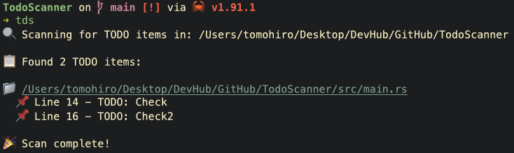

# TodoScanner

A fast, friendly tool to scan your codebase for TODOs, FIXMEs, and other actionable comments. Built in Rust for speed and reliability.

## Features

- Scan directories recursively for annotated comments (e.g., `TODO`, `FIXME`, `NOTE`)
- Supports common source file extensions (Rust, JS/TS, Python, etc.)
- Configurable markers and ignore patterns
- Clean, readable output with file paths and line numbers
- Exit codes suitable for CI workflows

## Installation
```sh
brew tap I-Dieod/tap
brew install tds
```

## Usage
```sh
# Scan current directory
tds

# Scan a specific path with default markers
tds path/to/project
```

## Example Output


## Roadmap
- Markdown/HTML report output
- Interactive TUI

## Contributing

Issues and PRs are welcome. Please open an issue with a clear description and minimal repro if you find a bug.

## License

MIT License. See `LICENSE` for details.

## Acknowledgments

Inspired by the need to keep TODOs visible and actionable during daily development and CI.
